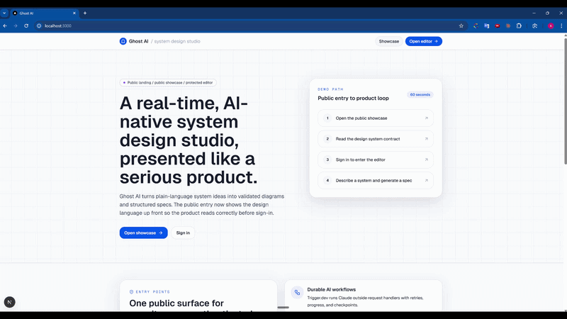

<p align="center">
  
</p>

<h1 align="center">Ghost AI — Real-time AI System Design Studio</h1>

<p align="center">
  Describe a system in plain language. Claude generates a validated architecture and streams it onto a live canvas where your team edits in real time. One click produces a structured Markdown technical spec, stored with a download link.
</p>

---

## Built with Spec-Driven Development

This project was built using a **spec-driven development** workflow with [Claude Code](https://claude.ai/code) as the implementation agent — not vibe coding, but as a collaborator that works from a defined contract.

The process:

```
1. Define architecture   →   write the system model, invariants, and constraints into context/
2. Spec the feature      →   describe what it does, what it must not do, and how it fits the system
3. Implement             →   Claude Code implements against the spec
4. Review                →   read the output, check invariants, test the behavior
5. Commit and advance    →   move to the next feature only when the current one passes review
```

The result is a codebase where every decision has a written reason, no feature drifts from the architecture, and a new engineer (human or AI) can get full context by reading [`context/ghost-ai.md`](context/ghost-ai.md) and [`context/tracker.md`](context/tracker.md) before touching the code.

---

## Demo



---

## Stack

| Layer | Technology |
|---|---|
| App framework | Next.js 16 + TypeScript (strict) |
| UI | Tailwind v4 + shadcn/ui + Lucide |
| Auth | Clerk — managed identity, per-resource access control |
| Database | PostgreSQL + Prisma v7 |
| Real-time | Liveblocks + React Flow — CRDT canvas sync, presence, room broadcast |
| Background jobs | Trigger.dev v4 — durable tasks, retries, phase metadata |
| Artifact storage | Vercel Blob |
| AI provider | Claude (Anthropic) via AI SDK — structured output with Zod |

---

## Quick Start

### Docker Compose (recommended)

```bash
git clone https://github.com/ahmedEid1/gohst.ai.git
cd gohst.ai
cp .env.example .env      # fill in all values — see Environment Variables below
docker compose up --build
```

Starts two containers: `ghostai-app` (Next.js on port 3000, runs `prisma migrate deploy` on boot) and `ghostai-trigger` (Trigger.dev background worker). Bring your own Postgres (I'm using the prisma managed postgres) — no local database container.

### Local Development

```bash
npm install
cp .env.example .env
npx prisma migrate dev

# Two terminals:
npm run dev          # Next.js dev server
npm run dev:trigger  # Trigger.dev worker
```

### Environment Variables

```env
# Postgres — any provider (Prisma Postgres, Neon, Supabase, RDS, etc.)
DATABASE_URL=postgresql://...

# Clerk
NEXT_PUBLIC_CLERK_PUBLISHABLE_KEY=pk_...
CLERK_SECRET_KEY=sk_...
NEXT_PUBLIC_CLERK_SIGN_IN_URL=/sign-in
NEXT_PUBLIC_CLERK_SIGN_UP_URL=/sign-up

# Liveblocks
LIVEBLOCKS_SECRET_KEY=sk_...
NEXT_PUBLIC_LIVEBLOCKS_PUBLIC_KEY=pk_...

# Trigger.dev
TRIGGER_SECRET_KEY=tr_...
TRIGGER_PROJECT_REF=proj_...
TRIGGER_ACCESS_TOKEN=tr_pat_...   # Personal Access Token — create at cloud.trigger.dev/account/tokens

# Anthropic
ANTHROPIC_API_KEY=sk-ant-...

# Vercel Blob
BLOB_READ_WRITE_TOKEN=vercel_blob_...
```

---

## Features

### Collaborative Canvas

- React Flow canvas synced in real time via Liveblocks — all users see the same state instantly
- Live cursors with user names and a Ghost AI presence indicator
- Shapes, colors, inline labels, edge routing, keyboard shortcuts, undo/redo, multi-select, autosave, and restore
- Six semantic node shapes: rectangle (services), cylinder (databases), hexagon (external), diamond (decisions), circle (clients), pill (gateways)
- Starter templates for common system architectures

### AI Architecture Generation

- **Plain-English prompt** → Claude generates a validated action plan (add / move / resize / update / delete nodes and edges) using `generateObject` with a Zod schema
- **Durable execution** — design agent runs as a Trigger.dev task, not inside a request handler; retries on failure
- **Real-time phase broadcast** — events sent to all room members as operations happen
- **Pre-mutation validation** — dangling edge references, duplicate IDs, and dimension violations are caught before the canvas is touched

### Technical Spec Generation

- One-click Markdown spec export from the current canvas state via Claude
- Specs stored in Vercel Blob and tracked in Postgres; previous versions accessible from the sidebar
- Secure authenticated download route with project membership verification

### Access Control

- Clerk authentication with owner and per-project collaborator roles
- Server-side access checks on every mutation; three-layer workspace guard
- Project sharing via invite link

### Design System

- All color, motion, and shape as CSS custom properties in [`app/globals.css`](app/globals.css), surfaced through Tailwind v4 `@theme inline` — no hex literals or raw color families in components
- Motion library: fade-in, slide variants, scale-in, pulse-ring, Ghost-flow — all honoring `prefers-reduced-motion`
- Public showcase at [`/ui-showcase`](app/ui-showcase) — no auth required

---

## AI Agent Flow

The design agent in [`trigger/design-agent.ts`](trigger/design-agent.ts):

```
User prompt
    │
    ▼
[1] Read current canvas state from Liveblocks storage
    │
    ▼
[2] Build system prompt with full canvas context
    (existing nodes, edges, IDs, positions, layout rules)
    │
    ▼
[3] Claude generates a structured action plan
    generateObject() + Zod schema = typed JSON, never free text
    │
    ▼
[4] Pre-mutation validation pass
    Filter dangling refs, duplicate IDs, dimension constraint violations
    │
    ▼
[5] Apply validated actions to live canvas via mutateFlow()
    Writes directly into Liveblocks shared storage
    │
    ▼
[6] Broadcast phase events to all room members throughout
```

**Architecture invariants:**
1. Long-running AI work never runs inside a request handler — always Trigger.dev
2. AI output is always Zod-validated before it can mutate shared canvas state
3. Canvas schema stays compatible across manual edits, templates, AI mutations, autosave, and spec generation
4. Every API mutation verifies auth and project membership before touching data

---

## Project Structure

```
gohst.ai/
├── app/
│   ├── api/              # Thin authenticated route handlers
│   ├── editor/           # Canvas workspace (Liveblocks room)
│   ├── ui-showcase/      # Public design-system surface (no auth)
│   └── (auth)/           # Clerk sign-in / sign-up pages
├── components/
│   ├── editor/           # Canvas, sidebars, presence, AI tab, spec tab
│   └── ui/               # shadcn/ui primitives
├── trigger/
│   ├── design-agent.ts   # AI canvas generation task
│   └── generate-spec.ts  # Technical spec generation task
├── lib/                  # Prisma, Liveblocks, AI schemas, access helpers
├── hooks/                # Client-side state and project action orchestration
├── prisma/
│   └── schema.prisma     # Database schema
├── types/                # Shared TypeScript types (canvas, Liveblocks)
└── context/              # Living spec-first development docs
    ├── ghost-ai.md       # Product, architecture, invariants, design system
    ├── tracker.md        # Workflow and current progress
    └── features/         # Per-feature briefs (F1–F9)
```

---

## License

MIT
